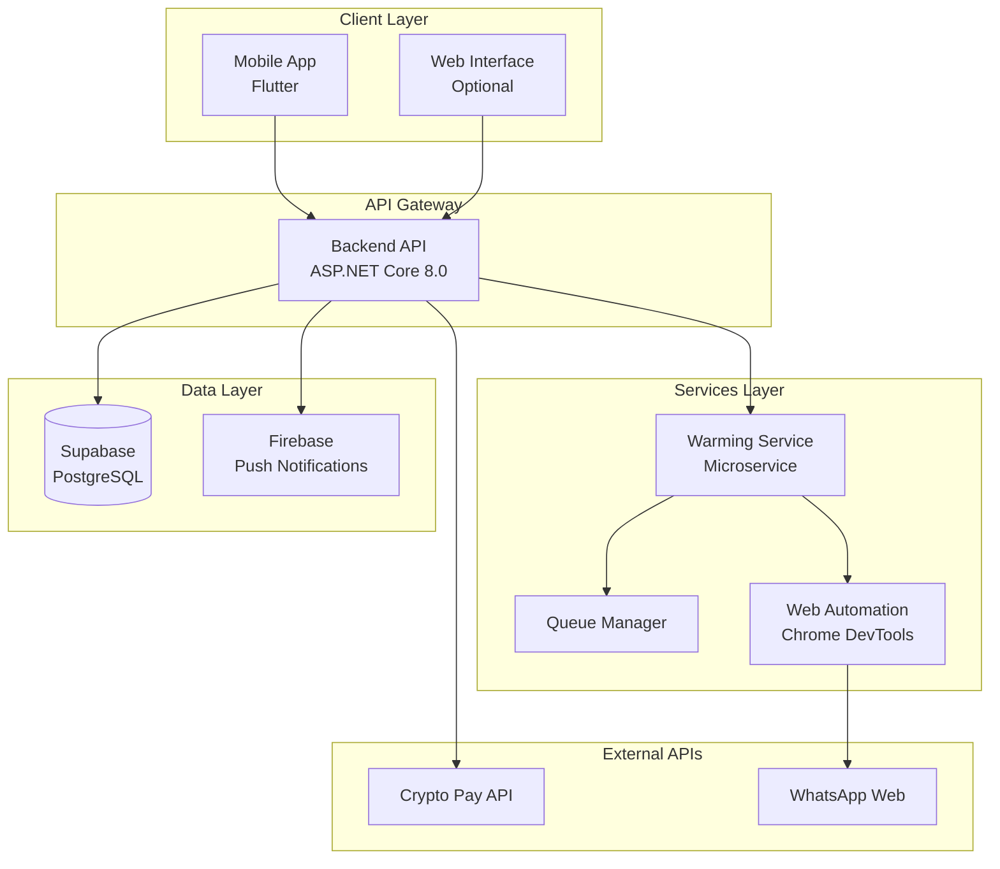
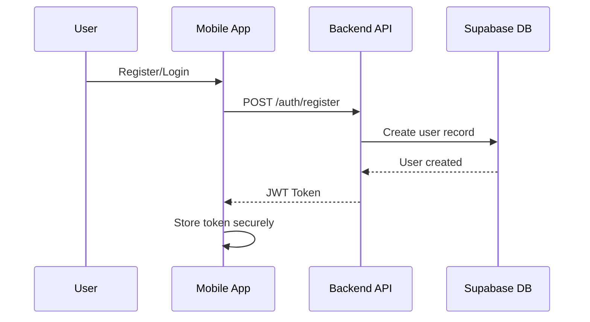
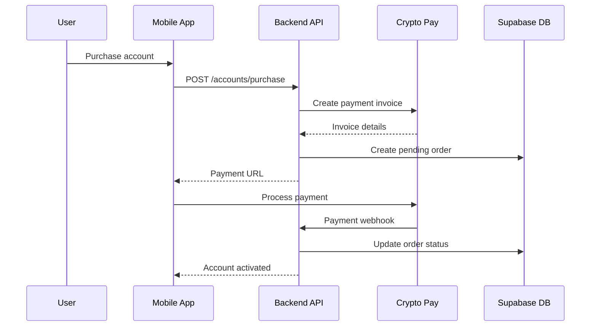
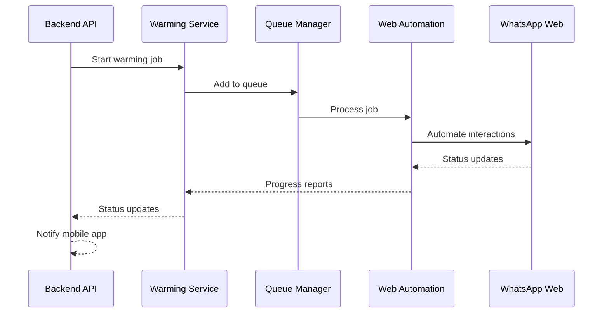

# 🏗️ Atlantis Grev - System Architecture

## 📋 Overview

Atlantis Grev is a modern, microservices-based WhatsApp account warming system built with a mobile-first approach. The architecture follows clean separation of concerns with three main components working together to provide a seamless user experience.

## 🎯 System Components



## 🔧 Component Architecture

### 1. Mobile Application (Flutter)

**Location**: `mobile/atlantis_grev_mobile/`

**Architecture Pattern**: Clean Architecture + Riverpod State Management

```
lib/
├── core/                 # Core utilities and constants
├── data/                 # Data layer (repositories, data sources)
├── domain/               # Business logic (entities, use cases)
├── presentation/         # UI layer (screens, widgets, providers)
└── shared/               # Shared components and utilities
```

**Key Technologies**:
- **Flutter 3.24.0** - Cross-platform framework
- **Riverpod** - State management and dependency injection
- **Dio** - HTTP client for API communication
- **Firebase** - Push notifications and analytics
- **Flutter Secure Storage** - Secure credential storage

**Communication**:
- RESTful API calls to Backend API
- WebSocket connections for real-time updates
- Firebase Cloud Messaging for push notifications

### 2. Backend API (ASP.NET Core)

**Location**: `backend/AtlantisGrev.API/`

**Architecture Pattern**: Clean Architecture + CQRS

```
AtlantisGrev.API/
├── Controllers/          # API endpoints
├── Services/             # Business logic services
├── Models/               # Data transfer objects
├── Middleware/           # Custom middleware
└── Configuration/        # Startup and configuration
```

**Key Technologies**:
- **ASP.NET Core 8.0** - Web API framework
- **JWT Authentication** - Secure token-based auth
- **Supabase Client** - Database operations
- **Entity Framework** - ORM (if needed)

**Responsibilities**:
- User authentication and authorization
- Account management and purchases
- Payment processing via Crypto Pay
- Warming job orchestration
- Real-time status updates
- Referral program management

### 3. Warming Service (Microservice)

**Location**: `warming-service/AtlantisGrev.WarmingService/`

**Architecture Pattern**: Queue-based Processing + Chrome DevTools Protocol

```
AtlantisGrev.WarmingService/
├── Program.cs            # Entry point and DI setup
├── WarmingWorker.cs      # Main warming logic
├── QueueManager.cs       # Job queue management
├── ApiClient.cs          # Backend API communication
├── MaxWebAutomation.cs   # Chrome automation wrapper
└── WebServer.cs          # Health check endpoint
```

**Key Technologies**:
- **.NET 8.0 Console Application** - Lightweight service
- **Chrome DevTools Protocol** - Browser automation
- **WebSocket** - Real-time browser communication
- **Queue-based Processing** - Concurrent job handling

**Responsibilities**:
- WhatsApp Web automation
- Concurrent warming session management
- Real-time progress reporting
- Error handling and recovery
- Browser session management

## 🔄 Data Flow Architecture

### 1. User Registration & Authentication Flow



### 2. Account Purchase Flow



### 3. Warming Process Flow



## 🛡️ Security Architecture

### Authentication & Authorization
- **JWT Tokens** with configurable expiration
- **Role-based access control** (User, Admin)
- **Secure token storage** in mobile app
- **API rate limiting** to prevent abuse

### Data Protection
- **HTTPS/TLS** for all communications
- **Environment variables** for sensitive configuration
- **Database encryption** via Supabase
- **Input validation** and sanitization

### Browser Security
- **Isolated Chrome profiles** for each warming session
- **Headless browser mode** for server deployment
- **Process isolation** between warming jobs
- **Automatic cleanup** of browser data

## 📊 Scalability Architecture

### Horizontal Scaling
- **Stateless API design** for load balancing
- **Multiple warming service instances** for high throughput
- **Queue-based job distribution** for load balancing
- **Database connection pooling** for performance

### Performance Optimization
- **Async/await patterns** throughout the codebase
- **Connection reuse** for HTTP clients
- **Efficient database queries** with proper indexing
- **Caching strategies** for frequently accessed data

### Monitoring & Observability
- **Structured logging** with correlation IDs
- **Health check endpoints** for all services
- **Performance metrics** collection
- **Error tracking** and alerting

## 🔧 Deployment Architecture

### Development Environment
```
Local Machine
├── Backend API (localhost:5000)
├── Warming Service (localhost:5001)
├── Mobile App (Flutter Debug)
└── Chrome Browser (DevTools enabled)
```

### Production Environment
```
Cloud Infrastructure
├── Backend API (Load Balanced)
├── Warming Service Cluster
├── Database (Supabase)
├── CDN (Static Assets)
└── Monitoring Stack
```

### Container Strategy
- **Docker containers** for consistent deployment
- **Docker Compose** for local development
- **Kubernetes** for production orchestration
- **Health checks** and auto-restart policies

## 🔄 Integration Points

### External Services
- **Supabase** - Primary database and real-time subscriptions
- **Crypto Pay** - Cryptocurrency payment processing
- **Firebase** - Push notifications and analytics
- **WhatsApp Web** - Target platform for automation

### Internal Communication
- **REST APIs** for synchronous operations
- **WebSockets** for real-time updates
- **Message queues** for asynchronous processing
- **Event-driven architecture** for loose coupling

## 📈 Future Architecture Considerations

### Planned Enhancements
- **Redis caching** for improved performance
- **Message broker** (RabbitMQ/Apache Kafka) for better scalability
- **API versioning** for backward compatibility
- **Microservices decomposition** as the system grows

### Technology Evolution
- **gRPC** for internal service communication
- **GraphQL** for flexible client queries
- **Event sourcing** for audit trails
- **CQRS** for read/write optimization

---

## 🎯 Architecture Principles

1. **Separation of Concerns** - Each component has a single responsibility
2. **Loose Coupling** - Components communicate through well-defined interfaces
3. **High Cohesion** - Related functionality is grouped together
4. **Scalability** - System can handle increased load gracefully
5. **Security First** - Security considerations are built into every layer
6. **Maintainability** - Code is clean, documented, and testable
7. **Performance** - Optimized for speed and resource efficiency

This architecture provides a solid foundation for the Atlantis Grev system while maintaining flexibility for future growth and enhancements.
